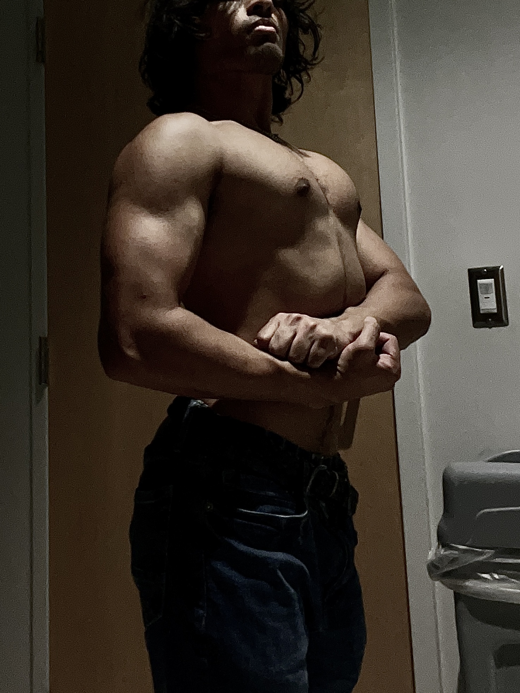
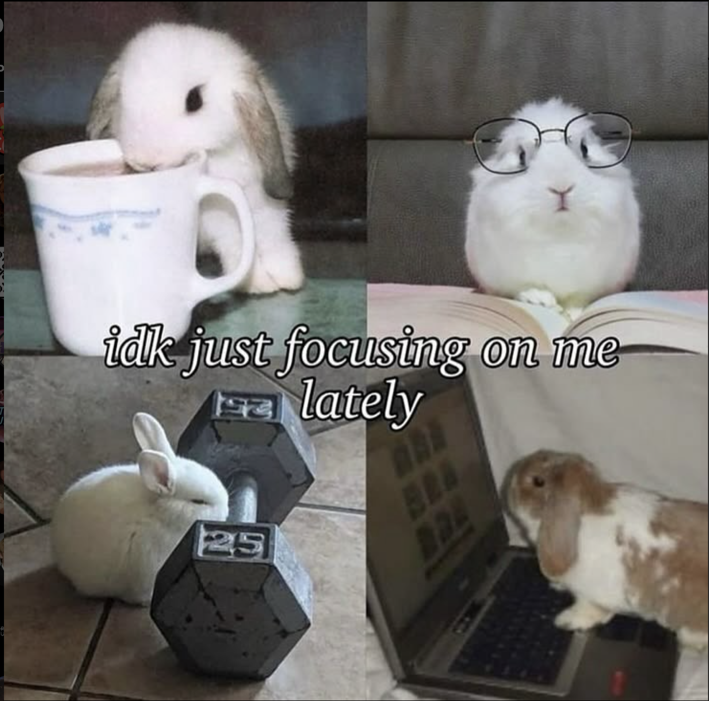
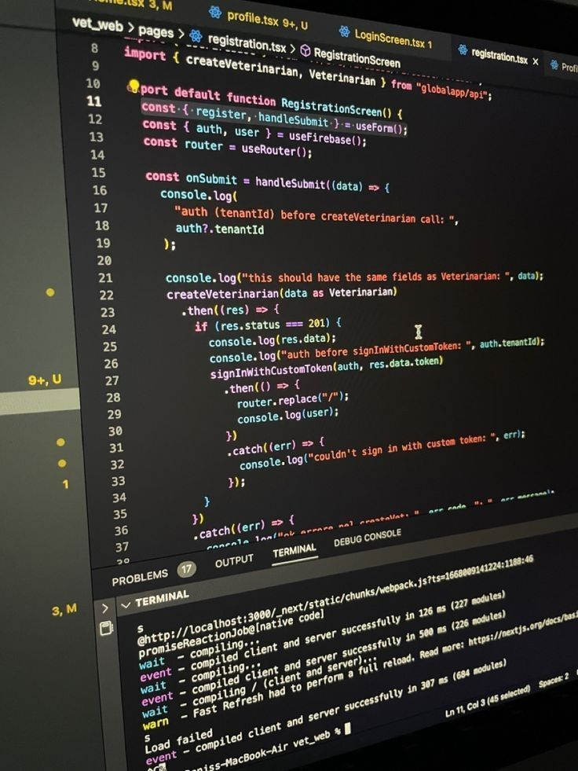
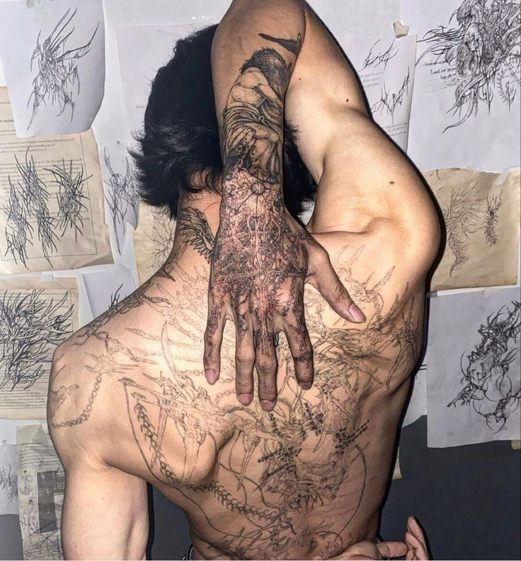
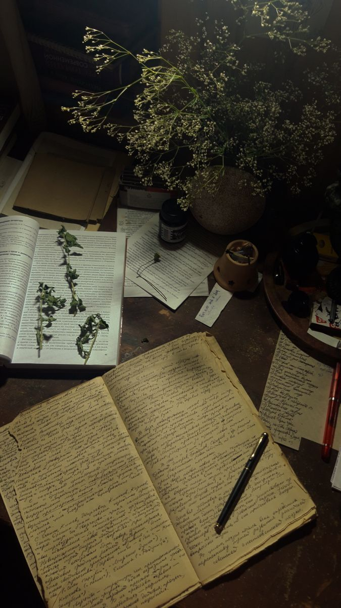

## *Fragmenta: Visibilia ad Gnosin*

*(Visual Fragments Towards Gnosis)*

> "The pursuit of knowledge, even knowledge of things remote and obscure, is in itself a high passion." 

  
  
  
   
  
  
  

---

<em>...in constant acquisition of gnosis.</em>

